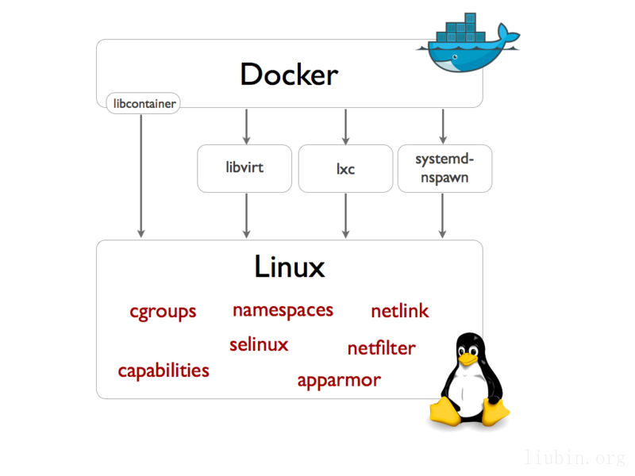
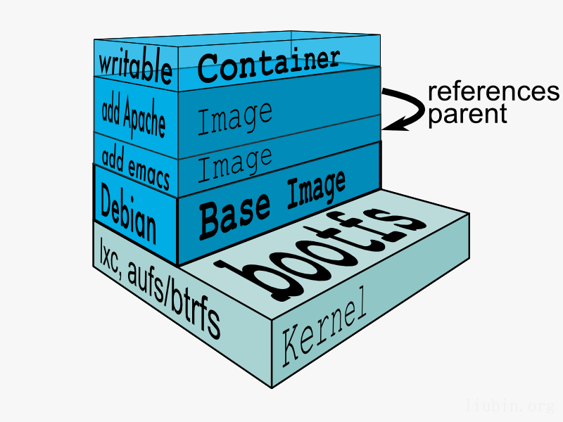

 

# 1. Docker的前世今生

**2013.03**	Docker项目启动，它是由PaaS提供商dotCloud开源的一个基于LXC的应用容器引擎。  	
**2013.10**	DotCloud公司改名为Docker Inc，转型专注于Docker引擎和Docker生态系统。	
**2014.06**	Docker1.0发布，从第一个版本到1.0版本的发布，在这段时间里，Docker逐渐成长为虚拟化技术领域的领先者，并得到了Linux发行商Red Hat和Canonical的支持。Google也对Docker有浓厚的兴趣，并将Docker技术运用到Google App Engine和Google Compute Engine 中。    
**2014.08**	Docker公司将其PaaS业务出售给德国一家公司，自己专注于核心的容器化业务。  
**2014.08**	Docker1.2版本发布。

Docker是构建在LXC之上的，基于进程容器的轻量级虚拟化技术，并没有什么全新的技术，但是Docker这种轻量级容器提供了良好的封装和互操作性，简单易用，使得它在开源社区得到快速发展。  
伴随着项目的发展，Docker公司对Docker的定位也在发生着变化。最初，Docker就是基于LXC的容器化工具；接着，演变成为一种Container Engine；到现在，Docker开始向构建、发布、运行分布式应用的平台方向发展。  
社区里有人预言，未来我们的开发工具，除了git，github，还会有docker，dockerhub。

# 2. Docker的技术栈
实际上Docker的出现离不开很多Linux kernel提供的功能，甚至可以说Docker在技术上并没有什么特别重大的创新之处，利用的都是已经非常成熟的Linux技术而已，这些技术早在Solaris 10或Linux Kernel 2.6的时候就有了。

## 2.1 Container虚拟化
Container虚拟化是相对于System虚拟化而言的：后者基于Hypervisor，实现对硬件的模拟，虚拟出多个Guest Kernel；而Container虚拟化使用Linux内核的namespace和cgroup来实现进程之间的隔离，容器之间是共享内核的。简单地说，容器虚拟化在启动运行效率和资源使用率有明显的优势。  
很多PaaS平台都是基于容器技术实现的，比如目前最成功的PaaS平台Heroku。此外，还有比较著名的开源PaaS平台Cloud Foundry的Warden以及Google的Lmctfy（Let Me Contain That For You）等。

**VM虚拟化**    
- 虚拟化的对象是虚拟机，把一台物理机虚拟成多台虚拟子机  
- VM虚拟化组件直接跑着硬件上  
- VM虚拟组件负责管理物理机或虚拟子机的硬件资源  
- 常见产品：VMWare，XEN，KVM，Hyper-V，Virtual Box，Open Stack等  

**Container虚拟化**    
- 操作的对象是进程，为每个进程分配不同的系统资源，进程与进程之间独立  
- Container只能跑在操作系统上  
- Container环境中硬件资源由操作系统自身负责管理  
- 常见产品：Linux Control Group，Solaries Zone，Linux chroot，Windows Sandboxie，OpenVZ，FreeVPS等  

## 2.2 LXC
LXC是在Linux下使用比较广泛的容器方案。基本上我们可以认为Linux containers = cgroups（资源控制） + namespaces（容器隔离）。  

**namespace**是用来为容器提供进程隔离的技术，每个容器都有自己的命名空间，比如pid/net/ipc/mnt/uts等命名空间，以及为容器提供不同的hostname。namespace能保证不同的容器之间不会相互影响，每个容器都像是一个独立运行着的OS一样。  
从宿主机来看，容器其实就是一组特殊的进程。

**cgroups**是一个Google贡献的项目，它主要用来对共享资源的分配、限制、审计及管理，比如它可以为每个容器分配CPU、内存以及blkio等的使用限额等。cgroups使得容器能在宿主机上能友好的相处，并公平的分配资源以及杜绝资源滥用的潜在风险。

 

上图中的cgroups、namespaces和apparmor等都是Linux内核提供的功能。不管是传统的LXC还是Docker的libcontainer，都使用了Kernel的这些功能来实现容器功能。 

## 2.3 libcontainer 
Docker从0.9版本将传统的LXC替换成libcontainer，使得Docker从一个单一的容器虚拟化工具，转变成为一种支持多种容器虚拟化技术（如Solaries Zone，FreeVPS等）的引擎。

## 2.4 AUFS
AUFS是Docker最能体现商业价值最核心的地方。联合文件系统是一个分层的轻量、高性能文件系统。Docker之所以这么吸引人，很大程度上在于其在镜像管理上所做出的创新。而联合文件系统正是构建Docker镜像的基础。

AUFS是一种Union FS，简单地说就是支持将不同目录挂载在到同一个虚拟文件系统下的联合文件系统，它可以对每一个成员目录设置‘readonly’，‘writeable’等权限（image为readonly，container为writeable），并且提供分层的概念。

之前提到过LXC，它在Linux2.6的Kernel就已经存在了，但是其设计之初并不是云计算服务的，缺少标准化的描述方法和容器的可迁移性，决定其构建出的环境难于迁移和标准化管理。Docker正是基于AUFS来实现增量更新、可移植性，已经共享image的功能。

 

> 参考  
> 0. [Docker, 云时代的交付方式][0]  
> 1. [VM(Virtual Machine)虚拟化方案与容器（Container）虚拟化方案][1]  
> 2. [Docker--Linux 容器引擎初探][2]  
> 3. [Docker简介][3]  

[0]:http://liubin.org/2014/08/11/docker-cloud-app-delivery-style/
[1]:https://community.emc.com/docs/DOC-18804
[2]:http://www.osforce.cn/course/211/learn#lesson/1064
[3]:http://my.oschina.net/ferest/blog/185995